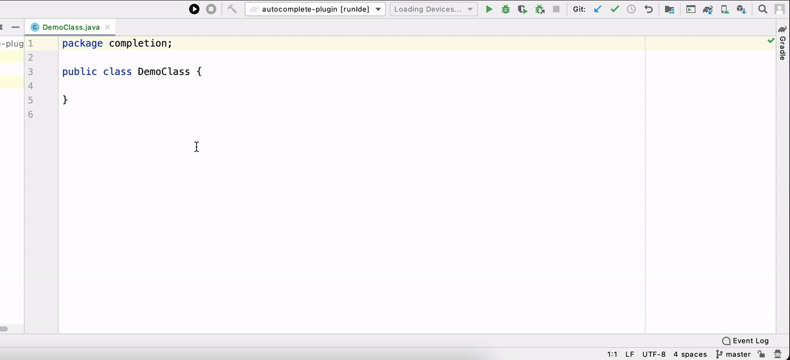

# FeaRS

FeaRS is a novel retrieval-based approach that, given the current code a developer is writing in the IDE, can recommend the next full method (i.e., signature and method body) that the developer is likely to implement.

# Structure of this repository
This repository contains two projects:
1. [FeaRS Android Studio Plugin](./FeaRS-plugin/)
2. [FeaRS Knowledege-Base Creator and Web Service](.FeaRS_app/)
